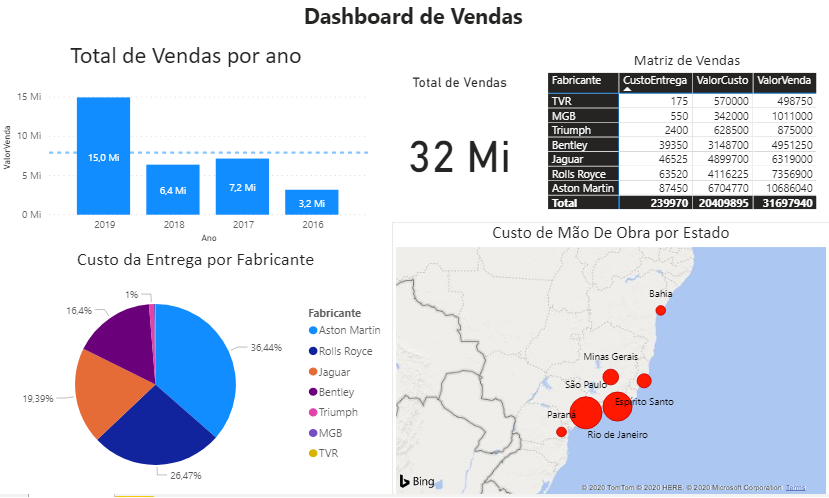
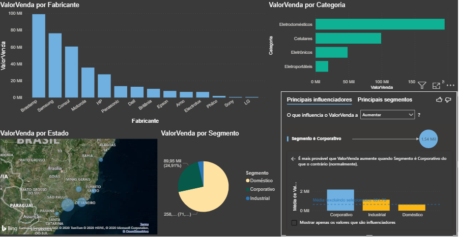

# DataScience_PowerBI

#### Estudo de caso 01 - Venda de carros.
Análise sobre os Dados de uma revendedora de automóveis de luxo. A empresa começou sua operação no Brasil em 2016 e atua nos quatro estados da região sudeste,mais os estados do Paraná e Bahia, fonte de dados é um arquivo Excel com dados coletados do sistema de vendas e CRM da empresa.

> Informações solicitadas:

- Total de Vendas por Ano
- Custo de Entrega do Veículo Por Fabricante
- Custo de Mão de Obra Por Estado
- Total de Vendas Geral e Matriz de Vendas

#### Estudo de caso 02 - Vendas de eletrônicos e eletrodomésticos.

A empresa está montando a estratégia de vendas para o próximo ano e precisa saber qual  dos  fabricantes  dos  produtos  vendidos,  apresenta  melhor  desempenho  nas  vendas.  O objetivo é descartar os fabricantes cujos produtos possuem poucas vendas e tentar negociar melhores condições com os principais fabricantes. A fonte de dados é um arquivo Excel com dados coletados do sistema de vendas,CRM e ERP da empresa.

